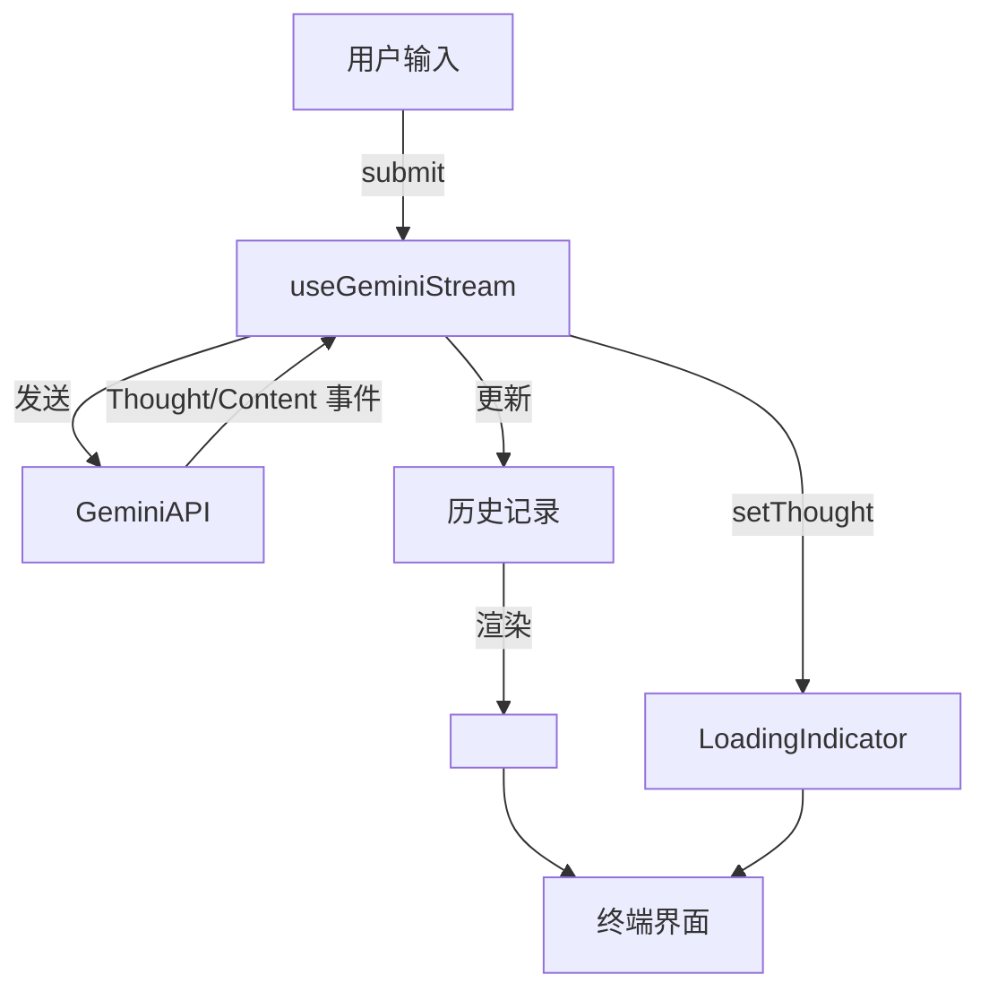

# CLI 界面设计分析

## 架构概览
- CLI 前端基于 [Ink](https://github.com/vadimdemedes/ink) 构建，利用 React 组件在终端渲染。
- 根组件 `App` 通过 `<Static>` 区域输出历史记录，避免重绘抖动【F:packages/cli/src/ui/App.tsx†L912-L947】。
- 消息以 `HistoryItem` 形式存储，由 `HistoryItemDisplay` 组件根据类型渲染不同结构【F:packages/cli/src/ui/components/HistoryItemDisplay.tsx†L47-L66】。

## 实时思考过程展示
- 钩子 `useGeminiStream` 订阅 Gemini 的流式事件，并在接收到 `Thought` 事件时更新思考内容【F:packages/cli/src/ui/hooks/useGeminiStream.ts†L563-L568】。
- 每次新对话开始时会清空思考状态，避免旧信息残留【F:packages/cli/src/ui/hooks/useGeminiStream.ts†L666-L669】。
- `LoadingIndicator` 从上下文获取当前思考并展示在界面上【F:packages/cli/src/ui/components/LoadingIndicator.tsx†L22-L40】【F:packages/cli/src/ui/components/LoadingIndicator.tsx†L64-L66】。

## 结构化响应展示
- `HistoryItemDisplay` 根据 `HistoryItem` 的 `type` 渲染用户消息、模型回复、工具调用等不同组件【F:packages/cli/src/ui/components/HistoryItemDisplay.tsx†L47-L66】。

## 全流程流程图

## 设计要点
- 通过 `StreamingState` 管理响应、等待确认等状态，实现 `esc` 取消和工具执行反馈【F:packages/cli/src/ui/hooks/useGeminiStream.ts†L164-L185】【F:packages/cli/src/ui/components/LoadingIndicator.tsx†L31-L44】。
- `HistoryItem` 结构保证输出可被解析并与工具结果、错误信息等组合展示。

## 后续优化
- 支持更丰富的思考可视化，如分阶段的 `ThoughtSummary` 展示。
- 引入性能监控，评估 `<Static>` 与消息分片策略的效果。

